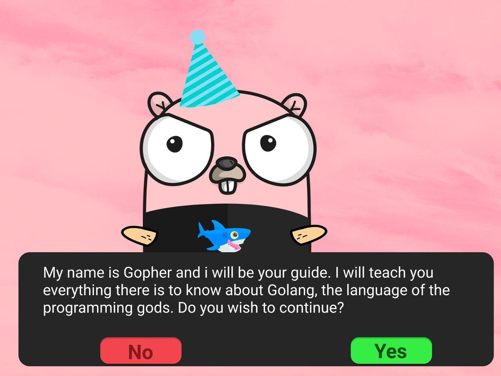

# Go Programming Tasks

This repository contains Go programs created as tasks for the Coursera course ["Functions, Methods, and Interfaces in Go"](https://www.coursera.org/learn/golang-functions-methods/home/welcome).

## Module 1 Activity: BubbleSort.go

### Description:

Build a Bubble Sort program that prompts users to input a sequence of up to 10 integers and prints them in sorted order.

### Requirements:
- Create a `BubbleSort()` function to sort a slice of integers using the bubble sort algorithm.
- Implement a `Swap()` function to swap two elements in a slice at specified indices.

## Module 2 Activity: DisplaceCalc.go

### Description:
Develop a program that calculates displacement based on a provided formula for a given set of initial conditions.

### Requirements:
- Implement a function `GenDisplaceFn()` that returns a function to compute displacement.
- Prompt users to input acceleration, initial velocity, initial displacement, and time.
- Compute and print displacement based on the provided time input.

## Module 3 Activity: InfoAnimals.go

### Description:
Create a program that provides information about predefined animals: cow, bird, and snake. Users can query each animal's food, locomotion method, and spoken sound.

### Requirements:
- Define an `Animal` struct containing fields for food, locomotion, and sound.
- Implement methods `Eat()`, `Move()`, and `Speak()` for the `Animal` type.
- Accept user queries and print out the requested data.

## Module 4 Activity: AnimalQuery.go

### Description:
Write a program that allows users to create and interact with a set of animals. Each animal can be a cow, bird, or snake, with unique names provided by the user. The program accepts commands to create new animals or query information about existing ones.

### Requirements:
- Define an `Animal` interface with methods `Eat()`, `Move()`, and `Speak()`.
- Implement types `Cow`, `Bird`, and `Snake`, each satisfying the `Animal` interface.
- Process `newanimal` commands to create new animals and `query` commands to get information about existing animals.

## Usage Instructions

1. Clone this repository to your local machine.
2. Navigate to the `src` directory containing the desired program.
3. Run the program using the Go compiler (`go run <filename>.go`).
4. Follow the on-screen prompts to interact with the program.